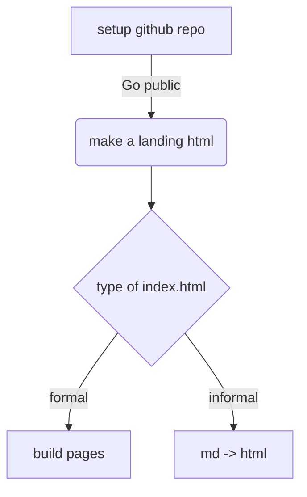

# html 프리뷰 하기 

# Why 
- html 파일을 프리뷰 하고 싶을 때 어떻게 해야 하나? 
- github의 주소를 던지면 github의 웹 버전이 뜬다. 

# Setup github repo 
- 깃헙 설정에서 pages를 활성화한다. 
	- 페이지스를 활성화하려면 리포가 공개되어 있어야 한다. 

# Make a landing page 
- 깃헙 페이지스는 해당 리포를 `YOUR-ACCOUNT.github.io/YOUR-REPO` 가 호출되면 제일 먼저 index.html을 찾아서 얘를 브라우저에 올려준다. 
- 따라서 index.html 페이지가 일종의 랜딩 페이지로 기능한다. 

# Type of index.html 

## Build pages
- index.html을 어떻게 만들 것인지는 자유다. 제대로 된 html 페이지를 세팅해서 이를 해당 리포의 랜딩 페이지로 활용할 수도 있을 것이다. 
	- 여러 페이지를 만들어서 해당 페이지 간의 링크 등을 설정하는 것이 가능하다. 

## md -> html 
- 별도의 페이지들을 만들 만큼 중후장대하지 않다면 간단하게 github 내의 html을 프리뷰하는 용도로 활용할 수 있다. 
- VS Code에는 md를 html로 변환해주는 여러가지 확장들이 있다. 나는 [Markdown All in One - Visual Studio Marketplace](https://marketplace.visualstudio.com/items?itemName=yzhang.markdown-all-in-one) 앱을 활용했다. 
	- VS Code에서 적당한 index.md 파일을 만든다. 
	- 여기 프리뷰가 필요한 파일의 해당 링크를 넣어 준다. 상대 링크를 활용할 수 있다. [Basic writing and formatting syntax - GitHub Docs](https://docs.github.com/en/get-started/writing-on-github/getting-started-with-writing-and-formatting-on-github/basic-writing-and-formatting-syntax#images)
	- md를 활용해서 필요한 정도의 링크 페이지를 만든다. 
	- F1(CTRL+SHIFT+P)을 눌러 커맨드 팔레트를 연다. 
		- markdown을 검색하면 Markdown All in One 확장에서 md를 html로 전환하는 명령이 있다. 이를 활용해 index.md에서 index.html을 생성한다. 
	- 해당 리포를 push 한다.
	- github actions에서 `index.html` 로 페이지를 빌드할 때까지 기다린다. 

### Examples 
- https://anarinsk.github.io/test_pyscript/
