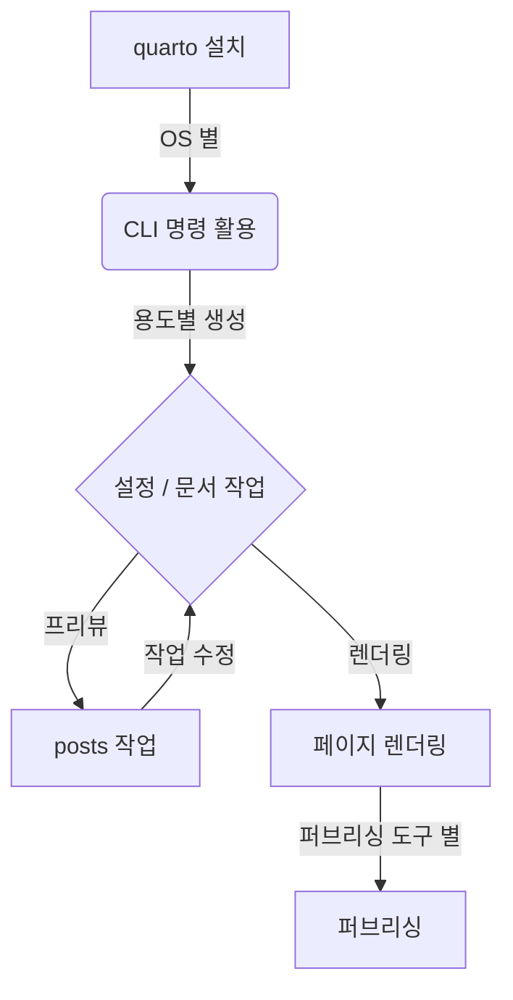

```mermaid
graph TD

    A[quarto 설치] -->|OS 별| B(CLI 명령 활용)
    B --> |용도별 생성| C{설정 / 문서 작업}
    C --> |프리뷰| D[posts 작업]
    D --> |작업 수정| C
    C --> |렌더링| E[페이지 렌더링]
	E --> |퍼브리싱 도구 별| F[퍼브리싱]
   
```
